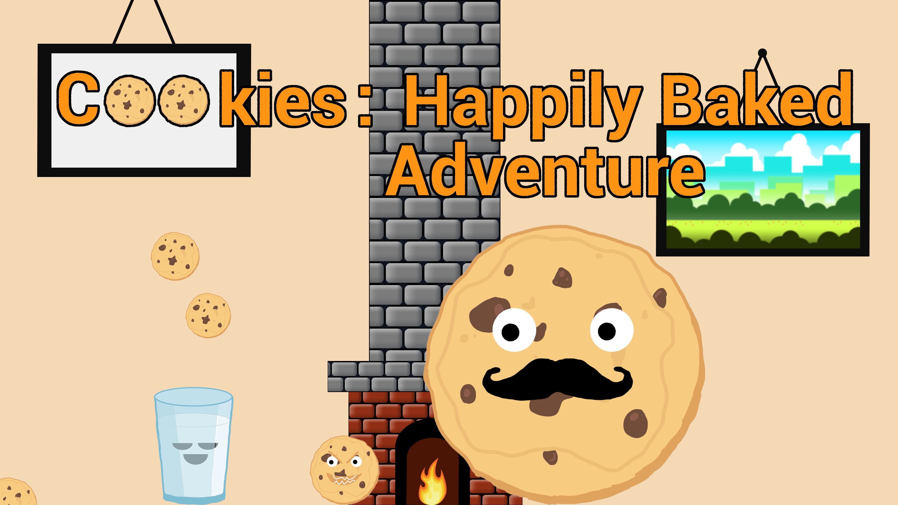
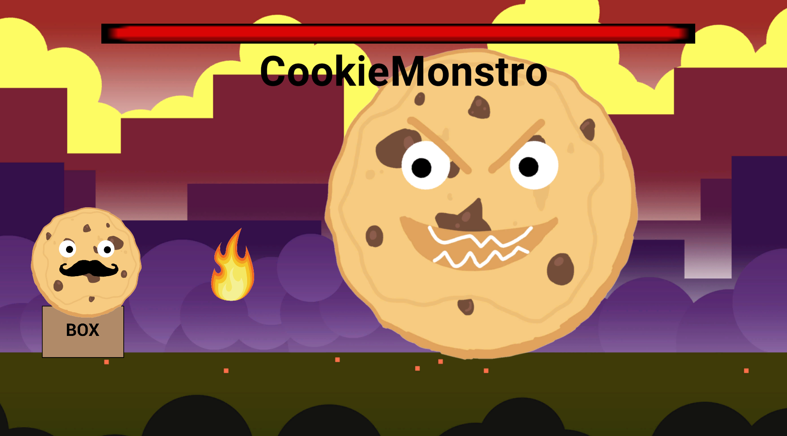
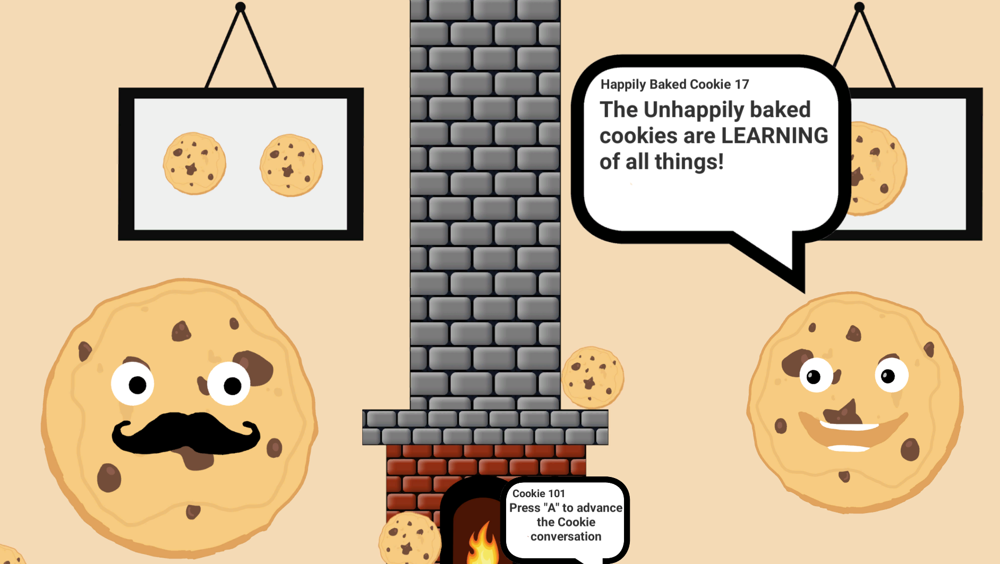
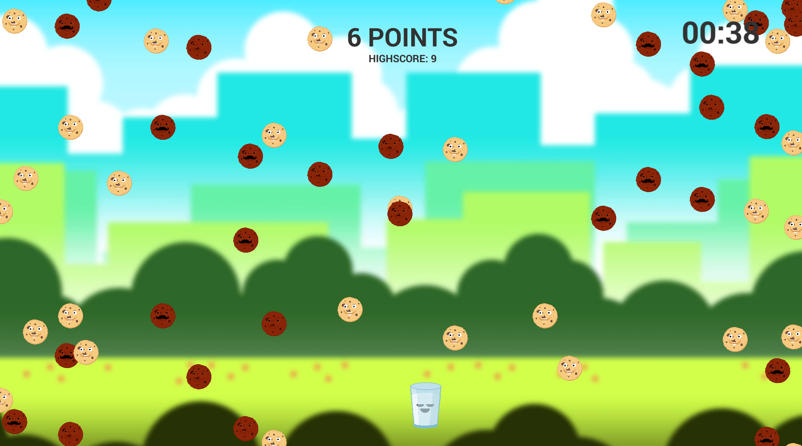

# Cookies-Happily-Baked-Adventure
My entry for the [Mini Jam #94](https://itch.io/jam/mini-jam-94-baking), my first game jam.
It uses [Unity](https://unity.com) game engine and the art was made using [Photoshop](https://www.adobe.com/products/photoshop.html).
- A short and silly story rich game. 
 Hope you enjoy!
 
 
 
 
 
 
 (Since I was in a time crunch, I didn't get to clean up the code and some files, but the game works as intended.
 The main problem is with screen size. Since I couldn't fix the UI elements in time, it only works properly if you don't change the window size, and preferably
 play in 1920 x 1080 resolution)
